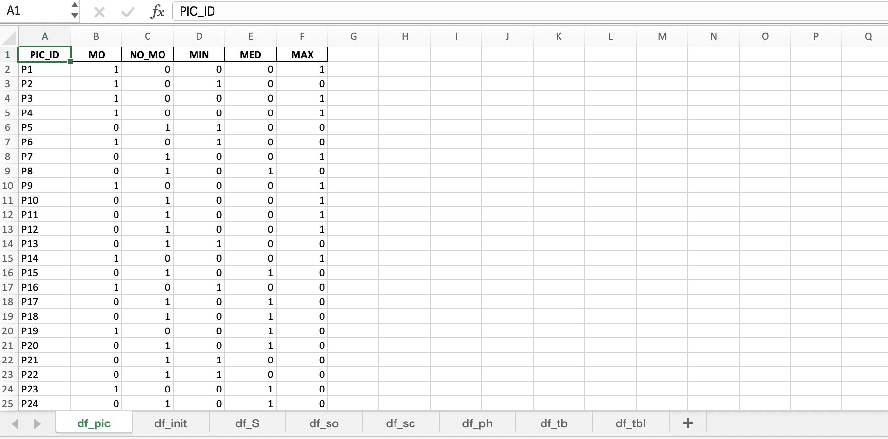
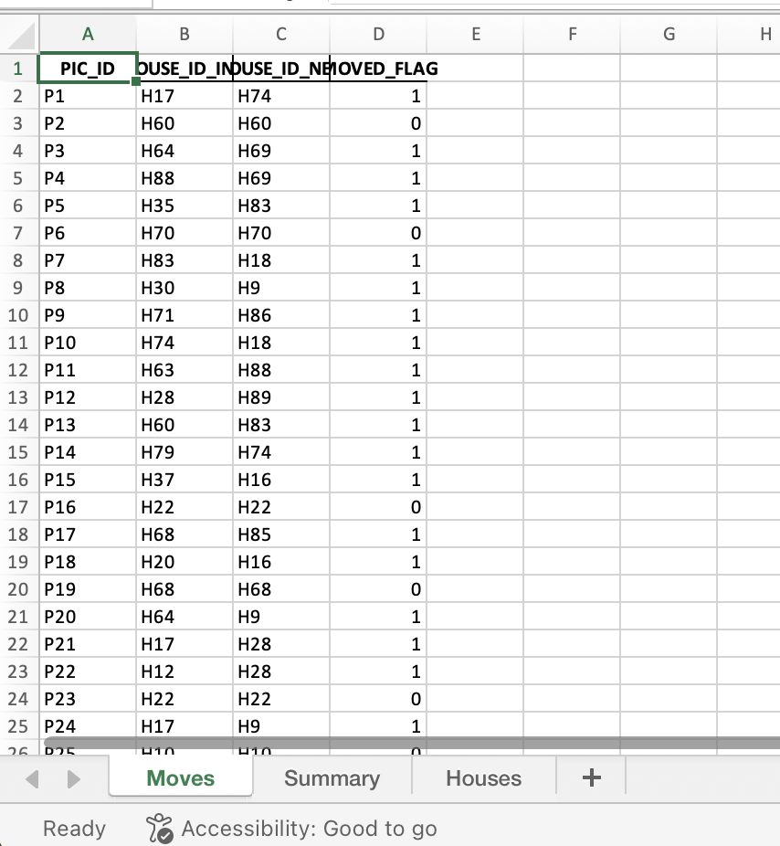

# PIC‑Movement

Optimising the placement and transfer of **People In Custody (PIC)** across housing units and Reconfiguring the type of housing units
*Columbia IEORx DOC — June 17 2025*

---

## Overview

Efficiently assigning PIC to housing units reduces overcrowding, limits unnecessary transfers, and saves operating costs. This allows to reconfiguring the types of housing units. This repo contains two Jupyter notebooks that let you **(1)** generate a synthetic dataset and **(2)** solve a mixed‑integer optimisation model.

---

## Repository layout

```
PIC-Movement/
├── movement-example-generating.ipynb   # create toy housing dataset
├── PIC-movement.ipynb                  # build & solve optimisation model
├── input/                                  # place real or synthetic data here
├── output/                                 # results (excel) are written here
└── README.md
```

---


## Notebook guide

| Notebook                                | Purpose                                                                                                                                                    | Key outputs                                         |
| --------------------------------------- | ---------------------------------------------------------------------------------------------------------------------------------------------------------- | --------------------------------------------------- |
| **`movement-example-generating.ipynb`** | Generate a toy dataset of housing units, capacities, feasible housing type, and PIC attributes.                                                                                | CSV files in `input/DATE/`                               |
| **`PIC-movement.ipynb`**                | Builds a MILP that minimises  $\text{units used} + \text{WEIGHT\_MOVEMENT\_HOUSE}\cdot \text{PIC moves}$. Reads data from `input/`, solves with PuLP (CBC), and writes results. | `output/_DATE_/result/output_moves.xlsx` |

### Configuration

Open the first cell of **`PIC-movement.ipynb`** and edit

```python
WEIGHT_MOVEMENT_HOUSE  = 0.1 # the number housing unit used
excel_path    = pathlib.Path.cwd() / "input" / "20250604_093243" / "input.xlsx" # change the location of the input here 
```

---

## Example results

Running `movement-example-generating.ipynb` gives the following in  `input`:



Running `PIC-movement.ipynb` gives the following in  `output`:



---


